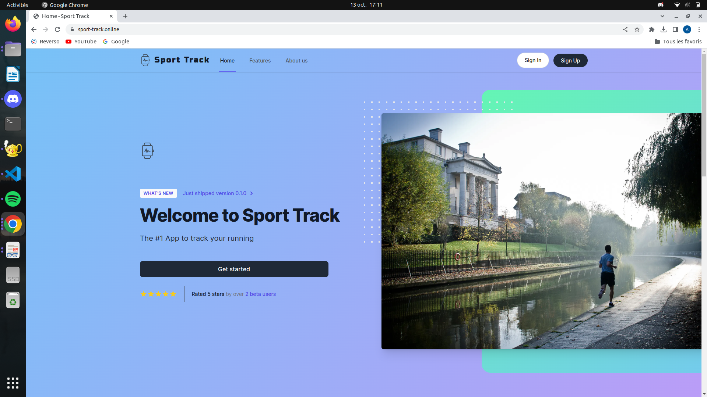
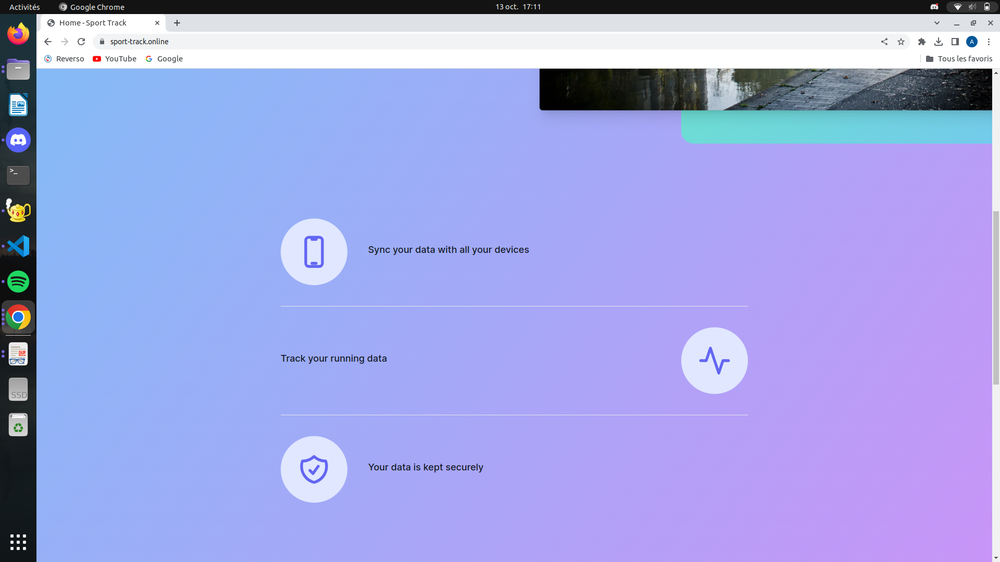
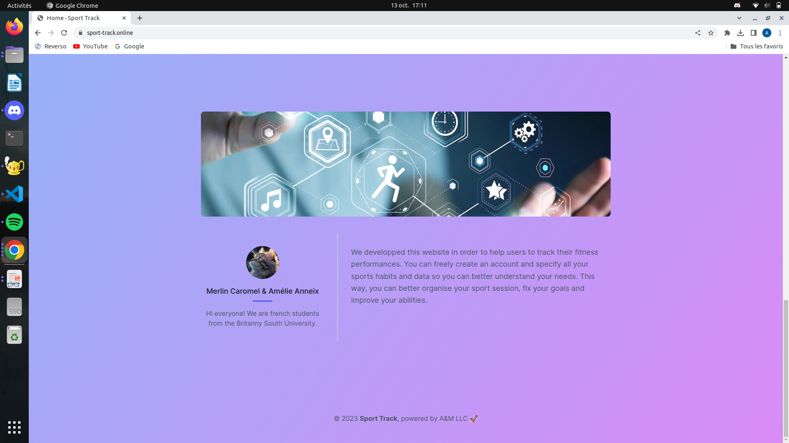
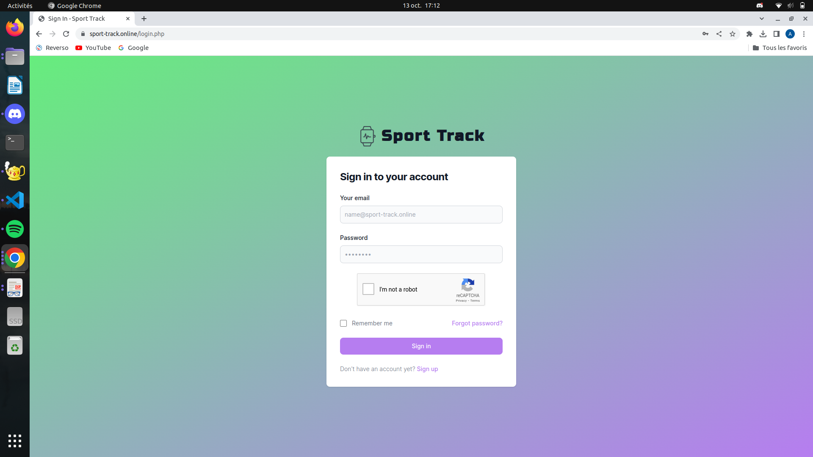
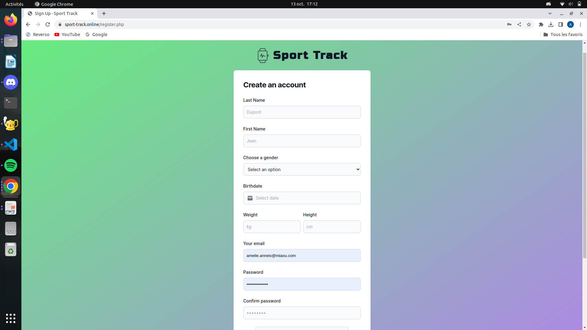
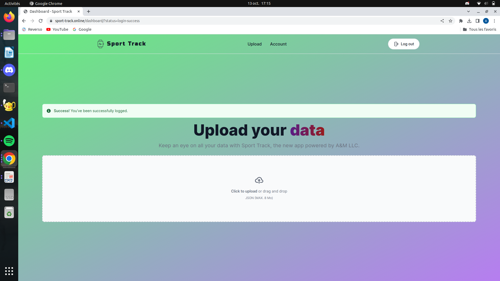
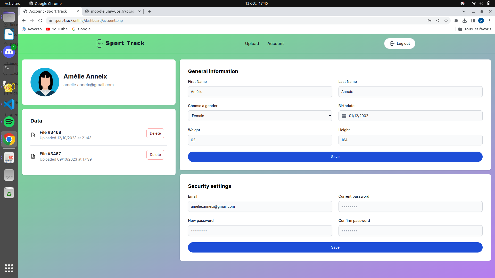
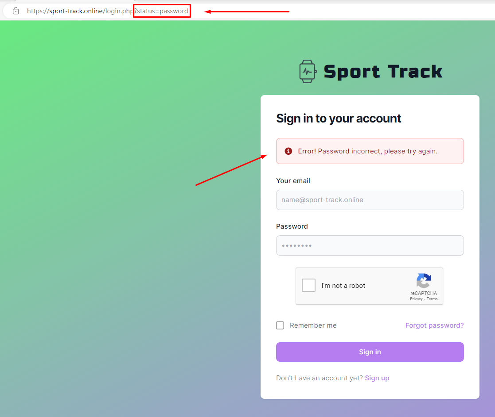

#  Sport Track
Dans le cadre de travaux pratiques de la ressource R3.01, nous avons eu à développer une application Web de suivi d’activités sportives. Cette application permet à des sportifs disposant d’une montre “cardio/gps” de pouvoir sauvegarder et gérer des données de position et de fréquence cardiaque.

## Démo en ligne 🌐
Une version du projet est disponible en ligne : [www.sport-track.online](https://sport-track.online)

## Fonctionnalités
Les fonctionnalités de l’application SportTrack sont les suivantes :
* __Gestion des comptes utilisateurs :__ L’application permet de créer, modifier et supprimer un compte utilisateur. Lors de la création de compte, les utilisateurs peuvent renseigner les informations suivantes :
    * Nom
    * Prénom
    * Date de naissance
    * Sexe
    * Taille
    * Poids
    * Adresse email
    * Mot de passe

* __Connexion des utilisateurs :__ Pour accéder à leurs données d’activité sportive et gérer ces données, les utilisateurs peuvent se connecter à l’application en utilisant leur adresse email et leur mot de passe.

* __Gestion des fichiers de données :__ Après s’être connectés à l’application, les utilisateurs peuvent déposer et supprimer des fichiers d’activité sportive.

## Screenshots

    
    
    
    
    
    
    

## Création
### Aspect graphique
Pour développer le front-end (aspect graphique) du site, nous avons utilisé le framework CSS Tailwind. Une fois le framework importé via le CDN officiel du framework (Content Delivery Network - Serveur qui met à disposition du contenu à des utilisateurs), nous avons utilisé des composants mis à disposition sur plusieurs sites dont Flowbite, TailwindUI et TailblocksCC.
### Formulaires
Nous avons tout d'abord réalisé la structure des formulaires en HTML avec les attributs dédiés à chaque champ (password, number, text, email). Par la suite, les formulaires ont été traité en PHP via la méthode POST et les données insérées dans une base de données MySQL (la structure de la base de données est téléchargeable depuis le répertoire GitLab). Afin d'obtenir une sécurité optimale, les données entrées par l'utilisateur sont vérifiés en PHP (type, complexité du mot de passe, format de l'email, etc.). Pour que l'utilisateur soit informé des différentes erreurs rencontrées, nous l'avons redirigé à travers des pages qui utilisent la méthode GET pour afficher les messages d'erreurs. 

### Téléversement des données
Afin de pouvoir gérer le système de suppression, nous avons fait le choix d'attribuer un identifiant unique à chaque fichier. Ainsi, nous avons pu stocker cet identifiant, la date et l'heure de mise en ligne du fichier dans la base de données du site. Cela permet à l'utilisateur d'avoir des informations sur les fichiers qu'il a pu téléverser, ainsi que la possibilité de les supprimer. 
